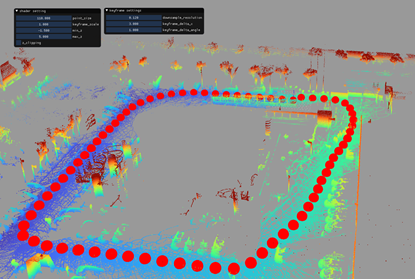
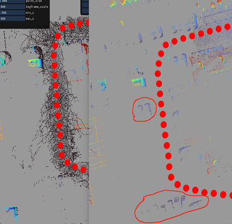

# Livox-Mapping

This repository implements an all-in-one and ready-to-use LiDAR-inertial odometry system for Livox LiDAR. The system is developed based on the open-source odometry framework [**LIO-Livox**](https://github.com/Livox-SDK/LIO-Livox) to get the odometry information in our front-end part. Besides, we have added more constraints and features to enhance the mapping performance. 

At the same time, we provide you one simple lidar-map based localization module in [Livox-Localization](https://github.com/SiyuanHuang95/Livox-Localization).


## 1. Features

We only describe the new features added to our baseline framework [**LIO-Livox**](https://github.com/Livox-SDK/LIO-Livox). For the amazing features developed by LIO-Livox, please check their own repository.

### 1.1 Loop Closure Detection

In the LCD part, we use the [**ScanContext**](https://github.com/irapkaist/scancontext)  to perform the loop closure detection and then add the loop closure constrains to the optimization solver. With the LCD module, we are able to close the gap and compensate the accumulated translation error of the scan matching in large environments.

| with Loop Closure              | without Loop Closure                 |
| ------------------------------ | ------------------------------------ |
|  |  |

### 1.2 Ground Constrain

To avoid the drifting alongside the Z-axis, the general problem occurred in LOAM (LiDAR Odometry and Mapping) algorithms, we add the the ground constraints ( the plane detection is done by LIO-Livox)  to the optimization solver as  **[hdl_graph_slam](https://github.com/koide3/hdl_graph_slam)**.

| with Ground Constrain                  | without Ground Constrain                          |
| -------------------------------------- | ------------------------------------------------- |
|  |  |

### 1.3 Map Merging from Multiple Rosbags

In practice, we usually collect environment data in multiple times, thus we need one functionality to fuse the map information from multiple rosbags. In this implementation, we use GPS information (optionally) to convert LiDAR scans collected in different time into one coordinate system and then use ScanContext and ICP to find fine matching result. At the same time, we maintain one lifelong optimization vector in our backend to store the previous key-frames. Through this approach, we  are able to connect scans in different collections.

|  |
| -------------------------------------------- |

#### 1.4 GPS Factor

 We also offer the GPS factor to aid the mapping process. This is only one optional choice. Without the GPS information, the whole system could also work.

### 1.5 Compatible with Mapping Editor *interactive_slam*

 [**interactive_slam**](https://github.com/SMRT-AIST/interactive_slam) is an open-source 3D LiDAR-based mapping framework. We add one functionality to output the mapping result in the format compatible with *interactive_slam*, by this, you can easily edit your mapping result and get one more accurate LiDAR map. At the same time, if you have one camera alongside the Livox, we also offer one dummy moving objects removal [function](SC-PGO/utils/moving_object_removal/README.md) with aid of [mmdection](https://github.com/open-mmlab/mmdetection) and easy LiDAR points projection.

| Represented in interactive_slam               | Moving Object Removal                                 |
| --------------------------------------------- | ----------------------------------------------------- |
|  |  |

## 2. Prerequisites

### 2.1 Dependencies for baseline

Our framework is developed based on the open-source framework [**LIO-Livox**](https://github.com/Livox-SDK/LIO-Livox) for odometry part,  [**ScanContext**](https://github.com/irapkaist/scancontext)  for loop closure part and [**interactive_slam**](https://github.com/SMRT-AIST/interactive_slam) for map-editing part (if you need), so technically, please refer to these repos for detailed information.

### 2.2 General Dependencies  

- [Ubuntu](http://ubuntu.com) (tested on 16.04 and 18.04)

- [ROS](http://wiki.ros.org/ROS/Installation) (tested with Kinetic and Melodic)

- [Eigen](http://eigen.tuxfamily.org/index.php?title=Main_Page)

- [Ceres Solver](http://ceres-solver.org/installation.html)

- [PCL](http://www.pointclouds.org/downloads/linux.html)

- [livox_ros_driver](https://github.com/Livox-SDK/livox_ros_driver)

- libsuitesparse

### 2.3 Docker

For one quick and convenient test, we are offering you a Docker Image with DockerHub.

Please check the DockerHub [Link](https://hub.docker.com/r/siyuanhuang95/livox_slam) for more information.

- Pull the docker image.

```shell
docker pull siyuanhuang95/livox_slam:release
```

- Execute the docker run command. You can use -v to bind the docker to your local machine as you wish.

```shell
docker run --gpus all -it -p 3316:22 --device=/dev/dri --group-add video --volume=/tmp/.X11-unix:/tmp/.X11-unix  --env="DISPLAY=$DISPLAY" siyuanhuang95/livox_slam:release /bin/bash
```

- To allow the RVIZ in Docker to run in the host PC. In the local mashine:

```shell
xhost +
```

## 3. Build

- Clone the repository and catkin_make

```shell
cd ~/catkin_ws/src
git clone https://github.com/PJLab-ADG/Livox-Mapping.git
cd ..
catkin_make
```

- Remember to source the livox_ros_driver before build (follow [livox_ros_driver](https://github.com/hku-mars/FAST_LIO#13-livox_ros_driver))

## 4. Run

### 4.1 Dataset Requirements

 Before running the mapping functionality, please make sure the sensor data are published to the correct rostopic.

- Livox LiDAR: /livox/lidar
- IMU: /livox/imu
- GPS: /localization/navstate_info

### 4.2 Run Mapping Function

- In one terminal, launch the **mapping thread**

```shell
# If you don't have the GPS data
cd ~/catkin_ws
source devel/setup.bash
roslaunch livox_mapping livox_mapping.launch save_path:="PATH_TO_SAVE_SLAM_POSE_RESULT"
```

```shell
# If you have the GPS data
cd ~/catkin_ws
source devel/setup.bash
roslaunch livox_mapping livox_mapping.launch useRTK:="true" save_path:="PATH_TO_SAVE_SLAM_POSE_RESULT"
```

- In another terminal, launch the **odometry thread**

```shell
cd ~/catkin_ws
source devel/setup.bash
roslaunch livox_odometry livox_odometry.launch save_path:="PATH_TO_SAVE_ODOM_RESULT_in_txt"
```

- In another terminal, play the rosbag

```shell
rosbag play YOUR_ROSBAG.bag
```

## 4.3 Multiple Bags Merge

If you have more rosbags collected in one same area, you can restart odometry thread at the end of the first odometry thread run and play the next package.

- In the terminal for **odometry thread**, use **Ctrl+C** to shut down the **old odometry thread**.
- In the terminal for **odometry thread**, use the command below to start one new odometry thread

```shell
roslaunch livox_odometry livox_odometry.launch save_path:="PATH_TO_SAVE_ODOM_RESULT_in_txt"
```

- Play one new rosbag.


## 5. Datasets

For the ease of usage, we are providing several test rosbags collected in one industrial park located in Shanghai. Please be aware that all codes and datasets included in this repository are for academic research purposes only. Other usages are **NOT** encouraged, and it is at your own risk. If You have any concerns including privacy, please contact us by sending an e-mail to huangsiyuan@pjlab.org.cn

The dataset can be downloaded through the Baidu Netdisk with:

```shell
Link：https://pan.baidu.com/s/17ElBOWiFVr68975FtXY8ZA 
Password：pjop
```


## 6. Acknowledgments

Thanks for the authors of **[LIO-Livox](https://github.com/Livox-SDK/LIO-Livox),** [**ScanContext**](https://github.com/irapkaist/scancontext)，[**Fast-LIO-SLAM**](https://github.com/gisbi-kim/FAST_LIO_SLAM) and  [**interactive_slam**](https://github.com/SMRT-AIST/interactive_slam).

## Contact

- If you have any questions, contact here please
  - Send email to shibotian@pjlab.org.cn [Preferred] or huangsiyuan@pjlab.org.cn.
  - Report issues on GitHub [Preferred].
  - For other coorperation possibilities, please contact shibotian@pjlab.org.cn [Preferred].
